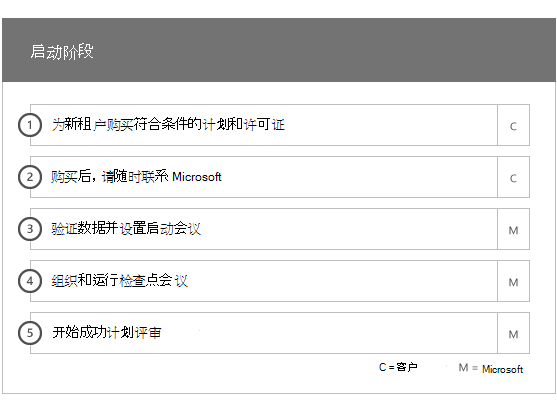
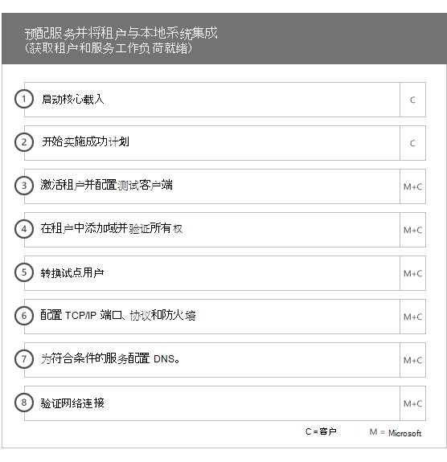

# 载入阶段

当您使用[符合条件的服务和计划](M365-eligible-services-and-plans.md)来获取 Microsoft Azure Active Directory Premium、microsoft Intune 和 Azure 信息保护准备就绪时, 该过程中涉及到几个阶段。 以下各节介绍了每个载入过程的阶段。

加入分为四个主要阶段:

## 启动阶段

购买相应数量的许可证后, 请按照购买确认电子邮件中的指导将许可证与现有租户或新租户相关联。 然后, Microsoft 验证您对 FastTrack 中心权益的资格, 并尝试联系你以提供加入帮助。

> [!NOTE]
> 如果您已准备好为组织部署这些服务, 您还可以从[FastTrack 中心](https://go.microsoft.com/fwlink/?linkid=780698)请求协助。

### 请求协助

1. 登录到 [FastTrack 站点](https://go.microsoft.com/fwlink/?linkid=780698)。
2. 选择“FastTrack”****。
3. 选择“服务”****。
4. 完成**Microsoft 365 表单的帮助请求**。

启动支持启动后, 我们将设置联机会议的日程安排。

> [!NOTE]
> 如果你的 Office 365 租户中列出了 Microsoft 合作伙伴, 你将不会看到此选项。 请咨询你的 Microsoft 合作伙伴以获取帮助。

Microsoft 合作伙伴也可以代表客户通过[FastTrack 网站](https://go.microsoft.com/fwlink/?linkid=780698)获取帮助。 To do so:

1. 登录到 [FastTrack 站点](https://go.microsoft.com/fwlink/?linkid=780698)。
2. 选择“FastTrack”****。
3. 选择“我的客户”****。
4. 搜索你的客户或从你的客户列表中选择。
5. 选择“服务”****。
6. 完成**Microsoft 365 表单的帮助请求**。

启动支持启动后, FastTrack 将设置与您的联机会议的计划, 以讨论载入过程、验证数据和设置启动会议。

## 评估阶段

载入过程开始后, FastTrack 中心将与您一起评估源环境和要求。 运行工具来评估您的环境, FastTrack 专家将指导您评估您的本地 Active Directory、Internet 浏览器、客户端设备的操作系统、域名系统 (DNS)、网络、基础结构和身份系统, 以确定是否需要进行任何更改以进行载入。

FastTrack 中心还将向你提供有关如何推动符合条件的服务的成功采用的指南。

根据你的当前设置, 我们提供了一个补救计划, 该计划将源环境最大限度地引入到 EMS 或其各个云服务的成功加入的最低要求。 我们还为修正阶段设置了适当的检查点调用。

## 修正阶段
您可以在源环境中执行修正计划中的任务, 以便满足载入和采用每项服务的要求 (根据需要)。

在开始启用阶段之前, 我们将联合验证补救活动的结果, 以确保准备好继续。

## 启用阶段
当所有修正活动完成后, 项目将切换到配置核心基础结构以实现服务消耗并设置每个符合条件的 EMS 云服务。

**启用相位-核心功能**

核心载入涉及服务预配以及租户和身份集成。 它还包括为提供联机服务 (如 Azure AD Premium、Intune 和 Azure 信息保护) 奠定基础的步骤。

> [!NOTE]
> WAP 代表 Web 应用程序代理。SSL 代表安全套接字层。SDS 代表学校数据同步。有关 SDS 的详细信息，请参阅[欢迎使用 Microsoft 学校数据同步](https://go.microsoft.com/fwlink/?linkid=871480)。

> [!NOTE]
> 托管的身份验证方法包括但不限于密码哈希同步。 身份集成是一次性活动, 不包括迁移或取消使用现有身份验证方法, 例如托管或联合。

### 启用阶段-Azure AD 高级版

可以使用 Azure Active Directory Connect tool Directory 同步和 Active Directory 联合身份验证服务 (AD FS) 设置 Azure AD Premium 环境 (根据需要)。

对于包括将本地标识同步到云的 Azure AD 高级方案, 我们通过向你的订阅添加 IT 管理员和用户来帮助你, 配置管理先决条件, 设置 Azure AD Premium, 设置目录使用 Azure AD Connect 工具与托管身份验证和 AD FS 同步, 配置测试用户并验证服务的核心用例。

Azure AD Premium 安装程序包括启用以下功能:

-   Azure Active Directory 自助服务密码重置 (SSPR)。

-   Azure 多因素身份验证 (Azure MFA)。

-   最多三台 (3) 或更多软件即服务 (SaaS) 应用程序集成, 使用来自[Azure Active Directory 市场](https://azure.microsoft.com/marketplace/active-directory/)的单一登录 (SSO)。

-   在[应用集成教程列表](https://docs.microsoft.com/en-us/azure/active-directory/saas-apps/tutorial-list)中列出的预集成 SaaS 应用程序的自动用户预配, 仅限于出站预配。

-   自定义登录屏幕, 包括徽标、文本和图像。

-   自助服务和动态组 (组)。

-   Azure Active Directory 应用程序代理。

-   Azure Active Directory Connect Health。

-   Azure Active Directory 条件访问。

-   Azure Active Directory 使用条款。

-   Azure Active Directory 标识保护。

-   Azure Active Directory 的特权标识管理。

-   Azure Active Directory 访问检查。

### 启用阶段-Intune

对于 Intune, 我们将指导你完成使用 Microsoft Intune 管理设备的准备工作。 具体步骤取决于源环境, 并且基于移动设备和移动应用管理需求。 这些步骤可以包括:

-   许可最终用户。 我们还提供了有关如何为你的 Microsoft 云服务租户激活批量许可证的帮助 (根据需要)。

-   通过利用本地 Active Directory 或云标识配置供 Intune 使用的标识。

-   将用户添加到 Intune 订阅、定义 IT 管理员角色以及创建用户和设备组。

-   根据您的管理需求配置移动设备管理 (MDM) 证书颁发机构, 其中包括:

    -   当 Intune 是唯一的 MDM 解决方案或与 Office 365 的移动设备管理配合使用时, 将 Intune 设置为 MDM 颁发机构。

-   提供适用于以下项的 MDM 指南:

    -   配置用于验证 MDM 管理策略的测试组。

    -   配置 MDM 管理策略和服务, 如:

        -   通过 web 链接或深层链接对每个受支持的平台进行应用程序部署。

        -   条件访问策略。

        -   如果你的组织中有现有的证书颁发机构、Wlan 或 VPN 基础结构, 则部署电子邮件、无线网络和虚拟专用网络 (VPN) 配置文件。

        -   设置 Microsoft Intune Exchange Connector (如果适用)。

        -   连接到 Intune 数据仓库

        -   将 Intune 与以下项集成:
            -   用于远程协助的团队查看器 (需要团队查看器订阅)。

            -   移动威胁防护 (MTD) 合作伙伴解决方案 (需要移动威胁防护订阅)。

            -   电信费用管理解决方案 (需要电信费用管理解决方案订阅)。

            -   Windows Defender 高级威胁防护 (Windows E5 或 Microsoft 365 E5 许可证是必需的)。

    -   将每个[受支持平台](https://technet.microsoft.com/library/dn600287.aspx)的设备注册到 Intune。

-   提供应用程序保护指导:

    -   为每个受支持的平台配置应用保护策略。

    -   为托管应用程序配置条件访问策略。

    -   将相应的用户组设定为具有上述 MAM 策略。

    -   使用托管应用程序使用情况报告。

-   提供 PC 管理指导:

    -   安装 Intune 客户端软件 (如果需要)。

    -   使用 Intune 中提供的软件和硬件报告。

    > [!IMPORTANT]
    > FastTrack 不支持使用 Intune 的 Windows 10 经典电脑管理。 FastTrack 仅支持通过 Intune 移动设备管理 (MDM) 进行 Windows 10 设备管理。

#### Windows Autopilot

通过将新设备提供给最终用户, FastTrack 可以帮助您简化设备预配, 而无需构建、维护自定义操作系统映像并将其应用到您的设备。

FastTrack 支持以下 Autopilot 方案:

- **AZURE AD 自助服务:** 设备加入 Azure AD 并注册到 Intune。 此方案在使用 Windows 10 1703 和最新版本时受支持。

- **混合 AAD 自助服务:** 设备将加入内部部署 AD 和 Azure AD, 并注册到 Intune。 此方案在使用 Windows 10 1809 和最新版本时受支持。

- **自设置:** 设备将自动加入 Azure AD。 此方案在使用 Windows 1809 和最新版本时受支持。

    > [!IMPORTANT]
    > FastTrack 不支持从 Configuration Manager 启动的 Autopilot 方案。

设置 Windows Autopilot 的步骤取决于源环境, 并且可以包括:

- 为 Windows Autopilot 配置和设置 Microsoft Intune。

- 配置 Azure AD 动态组

- 将公司品牌添加到 Azure AD 中。

- 创建设备并将其分配给 Windows Autopilot 配置文件 (例如, 限制本地管理员帐户创建的 Windows Autopilot 配置文件)。

- 自定义现成体验 (OOBE) 以符合组织的要求。

- 在 Azure AD 和 Intune 中配置 MDM 自动注册。

#### 安全部署 Outlook for iOS 和 Android

FastTrack 可帮助您在组织中安全地部署 Outlook for iOS 和 Outlook for Android, 以确保您的用户安装了所有必需的应用程序。

使用 Intune 安全部署适用于 iOS 和 Android 的 Outlook Mobile 的步骤取决于源环境, 并且可以包括:

- 通过 Apple App Store 或 Google Play 商店下载 Outlook for iOS 和 Android、Microsoft 身份验证者和 Intune 公司门户应用。
- 同时提供有关设置的指导:
    - Outlook for iOS 和 Android、Microsoft 身份验证者和 Intune 公司门户应用程序部署 (Intune)。
    - 应用保护策略
    - 条件访问策略
    - 应用配置策略

    > [!IMPORTANT]
    > FastTrack 团队不支持使用 Exchange 移动设备邮箱策略保护适用于 iOS 和 Android 的 Outlook。

#### 共同管理

FastTrack 引导您完成使用 Configuration Manager 和 Intune 同时管理 Windows 10 设备的准备工作。 具体步骤取决于您的源环境, 并且可以包括:

- 解释共同管理的好处。

- 许可最终用户。 FastTrack 还提供了有关如何为你的 Microsoft 云服务租户激活批量许可证的帮助 (根据需要)。

- 通过利用本地 Active Directory 和/或云标识, 配置由 Intune 使用的标识。

- 将用户添加到 Intune 订阅、定义 IT 管理员角色以及创建用户和设备组。

- 提供有关如何从与 System Center Configuration Manager (混合) 集成到 Intune 独立的 Intune 迁移的指南。

- 提供有关为 MDM 自动注册设置 Azure Active Directory 的指南。

- 提供用于设置混合 Azure Active Directory 加入的指南。

- 提供有关如何设置云管理网关的指南

- 在 Configuration Manager 控制台中启用联合管理。

- 配置要切换到 Intune 的受支持的工作负荷。

- 在 Intune 注册的设备中安装 Configuration Manager 客户端。

- 提供有关如何在您的环境中监视合作管理活动的指导。

FastTrack 还提供了有关如何促进符合条件的服务的成功采用的指导。

#### 启用阶段– Azure 信息保护

Azure 信息保护提供以下支持: 

- 客户能够在 Windows 上运行的 Office 应用程序 (如 Word、PowerPoint、Excel 和 Outlook) 中自动分类和标记信息, 并使用 Azure 信息保护客户端。 
- 使用 Azure 信息保护扫描程序的 rest 文件。
- 使用 Exchange Online 邮件流规则的传输中的电子邮件。 

此外, 还向希望使用 Microsoft Azure 权限管理服务 (Azure RMS)、Office 365 邮件加密 (OME) 和数据丢失防护 (DLP) 应用保护的客户提供支持。 

向客户提供有关如何执行以下操作的指南: 

- 激活并配置其租户。
- 创建和设置标签和策略。
- 对文档应用信息保护。 

> [!NOTE]
> **想要了解更多信息？** 请参阅[企业移动性 + 安全性](https://www.microsoft.com/en-us/cloud-platform/enterprise-mobility)。

## 后续步骤

[EMS-Microsoft 职责的 FastTrack 优势](EMS-fasttrack-responsibilities.md)
