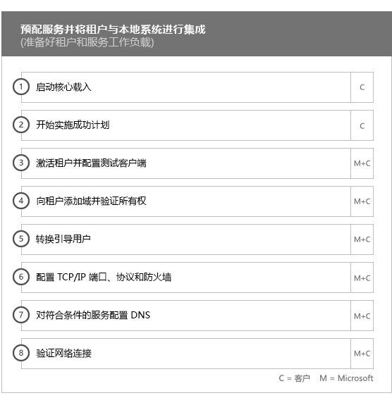
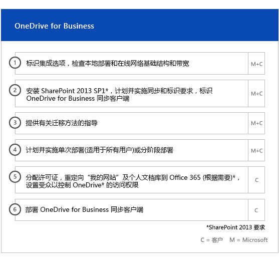
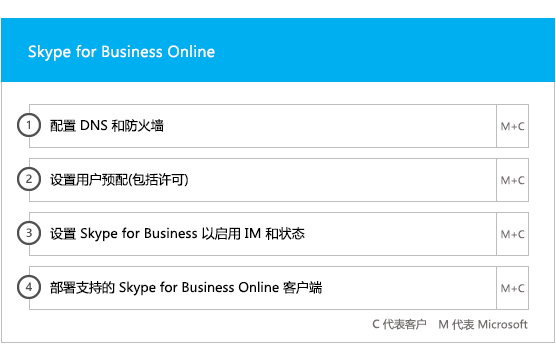

# 载入和迁移阶段

Office 365 onboarding has four primary phases—Initiate, Assess, Remediate, and Enable. You can follow these phases with an optional data migration phase as shown in the following figure.
  

  
> [!NOTE]
>有关载入和迁移 Office 365 美国政府版的信息，请参阅[载入和迁移 Office 365 美国政府版](US-Gov-appendix-onboarding-and-migration.md)。 

有关每个阶段的具体任务，请参阅 [FastTrack 责任](O365-fasttrack-responsibilities.md)和[你的责任](O365-your-responsibilities.md)。
  
## 启动阶段

在购买了正确数量和类型的许可证后，请按照购买确认电子邮件中的指导操作，将许可证与你的现有租户或新租户相关联。 
  
可以通过 [Microsoft 365 管理中心](https://go.microsoft.com/fwlink/?linkid=2032704)或 [FastTrack 站点](https://go.microsoft.com/fwlink/?linkid=780698)获得帮助。 

若要通过 [Microsoft 365 管理中心](https://go.microsoft.com/fwlink/?linkid=2032704)获取帮助，管理员需登录到管理中心，然后单击“需要帮助吗?”**** 向导。 

通过 [FastTrack 站点](https://go.microsoft.com/fwlink/?linkid=780698)获取帮助： 
1.    登录到 [FastTrack 站点](https://go.microsoft.com/fwlink/?linkid=780698)。 
2.    从登录页面顶部的“**快速操作**”中选择“**Microsoft 365 的请求帮助**”，或者在部署卡上选择“**Microsoft 365 的请求帮助**”。
3.    完成“**Microsoft 365 的请求帮助**”表单。 
  
Partners can also get help through the [FastTrack site](https://go.microsoft.com/fwlink/?linkid=780698) on behalf of a customer. To do so:
1.    登录到 [FastTrack 站点](https://go.microsoft.com/fwlink/?linkid=780698)。 
2.    选择“我的客户”****。
3.    搜索你的客户或从你的客户列表中选择。
4.    选择“服务”****。
5.    完成“**Microsoft 365 的请求帮助**”表单。

也可以从为租户提供的服务列表中的 [FastTrack 站点](https://go.microsoft.com/fwlink/?linkid=780698)寻求 FastTrack 中心帮助。 
    
During this phase, we discuss the onboarding process, verify your data, and set up a kickoff meeting. This includes working with you to understand how you intend to use the service and your organization's goals and plans to drive service usage.
  

  
## 评估阶段

Your FastTrack Manager conducts an interactive success planning call with you and your adoption team. This introduces you to the capabilities of the eligible services you purchased, the key foundations you need for success, the methodology for driving usage of the service, and scenarios you can use to get value from the services. We assist you in success planning and provide feedback on key areas (as needed).
  
FastTrack Specialists work with you to assess your source environment and the requirements. We provide tools for you to gather data about your environment and  guide you through estimating bandwidth requirements and assessing your internet browsers, client operating systems, Domain Name System (DNS), network, infrastructure, and identity system to determine if any changes are required for onboarding. 
  
Based on your current setup, we provide a remediation plan that brings your source environment up to the minimum requirements for successful onboarding to Office 365 and, if needed, for successful mailbox and/or data migration. We provide a set of suggested activities to increase end user value and adoption. We also set up appropriate checkpoint calls for the Remediate phase.
  

  
## 修正阶段

您基于您的源环境执行修正任务，以便您满足载入、采用和迁移每个服务所需的要求。
  

  
We also provide a set of suggested activities to increase end user value and adoption. Before beginning the Enable phase, we jointly verify the outcomes of the remediation activities to make sure you're ready to proceed. 
  
在此阶段中，你的 FastTrack 经理会与你一起制定成功计划，指导你选择合适的资源和最佳做法，来提供使该服务适用于你的组织并推动跨服务使用率的指导。
  
## 启用阶段

当所有修正活动完成后，重点会转为配置服务占用的核心基础结构、预配 Office 365 和执行推行服务采用的相关活动。 
  
## 核心

Core onboarding involves service provisioning and tenant and identity integration. It also includes steps for providing a foundation for onboarding services like Exchange Online, SharePoint Online, and Skype for Business Online. You and your FastTrack Manager continue to have success planning checkpoint meetings to evaluate progress against your goals and determine what further assistance you need.
  

  

  
> [!NOTE]
> WAP stands for Web Application Proxy. SSL stands for Secure Sockets Layer. SDS stands for School Data Sync. For more information on SDS, see [Welcome to Microsoft School Data Sync](https://go.microsoft.com/fwlink/?linkid=871480). 
  
在核心载入完成后，便可以开始载入一个或多个符合条件的服务。
  
## Exchange Online

For Exchange Online, we guide you through the process to get your organization ready to use email. The exact steps, depending on your source environment and your email migration plans, can include providing guidance for:
- 为 Office 365 中验证的所有启用邮件的域设置 Exchange Online Protection (EOP) 功能。
    > [!NOTE]
    > 你的邮件交换 (MX) 记录必须指向 Office 365。 
- 设置 Office 365 高级威胁防护 (ATP) 功能（如果它属于订阅服务）。 有关详细信息，请参阅 [Office 365 高级威胁防护](#office-365-advanced-threat-protection)。
- Setting up the data loss prevention (DLP) feature for all mail-enabled domains validated in Office 365 as part of your subscription service. This is done once your MX records point to Office 365.
- Setting up Office 365 Message Encryption (OME) for all mail-enabled domains validated in Office 365 as part of your subscription service. This is done once your MX records point to Office 365.

> [!NOTE]
> 邮箱复制服务 (MRS) 尝试将用户本地邮箱中的 Information Rights Managed (IRM) 电子邮件迁移到相应的 Exchange Online 邮箱。 可读取受保护内容迁移后的能力取决于客户映射和将 Active Directory Rights Managed Services (AD RMS) 模板复制到 Azure Rights Management Service (Azure RMS)。

- 配置防火墙端口。
- 设置 DNS，包括所需的自动发现、发件人策略框架 (SPF) 和 MX 记录（根据需要）。 
- 设置源邮件环境和 Exchange Online 之间的电子邮件流（根据需要）。
- 执行从源邮件环境到 Office 365 的邮件迁移。
- 配置邮箱客户端（Outlook for Windows、Outlook 网页版以及 Outlook for iOS 和 Outlook for Android）。
    > [!NOTE]
    > 有关邮件和数据迁移的详细信息，请参阅[数据迁移](O365-data-migration.md)。 
  

  
## SharePoint Online 和 OneDrive for Business

对于 SharePoint Online 和 OneDrive for Business，我们提供针对以下方面的指导：
- 设置 DNS。
- 配置防火墙端口。
- 设置用户和许可证。   
- 配置 SharePoint 混合功能，如混合搜索、混合网站、混合分类、内容类型、混合自助式网站创建（仅适用于 SharePoint Server 2013）、扩展的应用启动器、混合 OneDrive for Business 和 Extranet 网站。
    
FastTrack 专家综合使用工具和文档，以及在适用和可行的情况下执行配置任务，提供有关将数据迁移到 Office 365 的指导。
  

  
## OneDrive for Business

对于 OneDrive for Business，具体步骤取决于你目前是否在使用 SharePoint 以及所使用的版本。 
  

  
## Office 365 高级威胁防护

对于 Office 365 ATP，我们提供针对以下方面的指导：
- 启用安全链接、安全附件和防钓鱼。 
- 配置自动化、调查和响应。
- 使用攻击模拟器。
- 报告和威胁分析。

## Microsoft 信息管控

对于 Microsoft 信息管控，我们将提供以下方面的指导：

- 信息管控。
- 保留标签和策略。
- 记录管理。
- 删除策略。
- 通信合规性。
- 内部风险管理 
- 高级电子数据展示。

## Microsoft 信息保护

对于 Microsoft 信息保护，我们将提供以下方面的指导：
- 通过内容浏览器和活动浏览器了解你的数据。
- 敏感度标签。
- 数据分类。
- 针对 Microsoft Teams 聊天和频道的数据丢失防护 (DLP) 策略。
- 信息保护。
- 统一标记。

## Microsoft Teams

对于 Microsoft Teams，我们提供针对以下方面的指导：
- 确认最低要求。  
- 配置防火墙端口。   
- 设置 DNS。 
- 确认是否已在 Office 365 租户上启用 Microsoft Teams。  
- 启用或禁用用户许可证。
    

## Skype for Business Online

对于 Skype for Business Online，我们提供针对以下方面的指导：
- 配置防火墙端口。
- 设置 DNS。   
- 创建任何聊天室系统设备的帐户。   
- 部署支持的 Skype for Business Online 客户端。  
- 在本地 Lync 2010、Lync 2013 或 Skype for Business 2015 服务器环境与 Skype for Business Online 租户（如果适用）、通话套餐、Skype 会议直播、电话系统和通话套餐（在可用市场中）之间建立拆分域服务器配置。
    

  

  
## Power BI

对于 Power BI，我们提供针对以下方面的指导： 
- 分配 Power BI 许可证。
- 部署 Power BI Desktop 应用。
    
## Project Online

对于 Project Online，我们提供针对以下方面的指导：
  
- 验证 Project Online 依赖的基本 SharePoint 功能。   
- 向你的租户添加 Project Online 服务（包括向用户添加订阅）。  
- 设置企业资源池 (ERP)。 
- 创建你的首个项目。 
    

  
## Project Online Professional 和 Project Online 高级版

对于 Project Online Professional 和 Project Online 高级版，我们提供针对以下方面的指导：
- 解决部署问题。
- 使用 [Microsoft 365 管理中心](https://go.microsoft.com/fwlink/?linkid=2032704)和 Windows PowerShell 分配最终用户许可证。  
- 使用即点即用从 Office 365 门户安装 Project Online 桌面客户端。
- 使用 Office 365 部署工具配置更新设置。  
- 为 Project Online 桌面客户端 设置一个现场分发服务器，包括帮助创建 configuration.xml 文件以与 Office 365 部署工具一起使用。  
- 将 Project Online 桌面客户端 连接到 Project Online Professional 或 Project Online 高级版。
    

  
## Yammer Enterprise

对于 Yammer，我们提供有关启用 Yammer Enterprise 服务的指导。
  
## Microsoft 365 应用版

对于 Microsoft 365 应用版，我们提供针对以下方面的指导：
- 解决部署问题。   
- 使用 [Microsoft 365 管理中心](https://go.microsoft.com/fwlink/?linkid=2032704)和 Windows PowerShell 分配基于最终用户和设备的许可证。 
- 使用即点即用从 Office 365 门户安装 Microsoft 365 应用版。   
- 在 iOS 或 Android 设备上安装 Office Mobile 应用（如 Outlook Mobile、Word Mobile、Excel Mobile 和 PowerPoint Mobile）。   
- 使用 Office 365 部署工具配置更新设置。   
- 本地或云安装的选择和设置。 
- 使用 Office 自定义工具或用于配置部署包的本地 XML 创建 Office 部署工具配置 XML。  
- 使用 Microsoft Endpoint Configuration Manager 的部署，包括帮助创建 Microsoft Endpoint Configuration Manager 打包。
    

  
## Outlook for iOS 和 Outlook for Android

对于 Outlook for iOS 和 Outlook for Android，我们提供以下方面的指导：
- 从 Apple App Store 和 Google Play 下载 Outlook for iOS 和 Outlook for Android。
- 配置帐户和访问 Exchange Online 邮箱。
